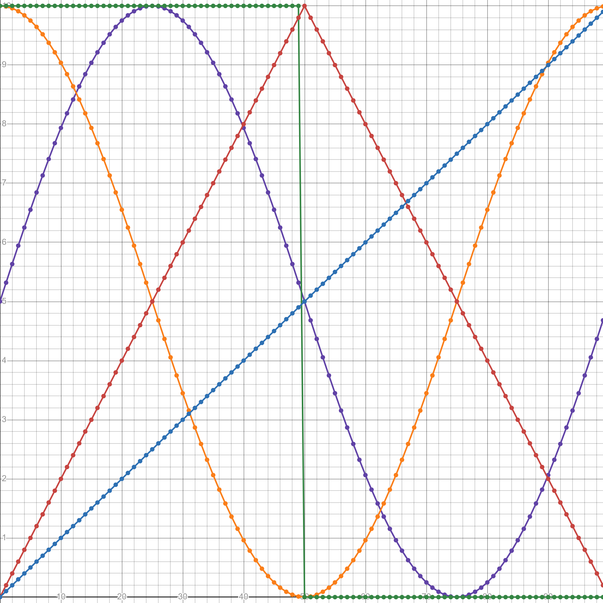

# Statically Allocated Look-Up Table (SALUT)

## Overview

The **Statically Allocated Look-Up Table (SALUT)** library is a lightweight, header-only C library for generating compile-time LUTs (look-up tables) using X-macros. It is designed to generate numeric lookup values at compile-time with zero runtime overhead.

SALUT allows multiple LUTs to coexist in a single translation unit without collisions, and provides a clean inline accessor for safe lookup with bounds checking.

## Features

- **Compile-Time LUT Generation:** LUT entries are computed entirely at compile-time using the C preprocessor.
- **Configurable Size and Type:** You define the data type, LUT size, and value function using macros.
- **Chunked Unrolling:** LUTs are expanded in power-of-two chunks for faster compile time and better readability.
- **Inline Accessor Function:** Provides a safe accessor function for indexed lookup.
- **Multiple LUT Support:** Easily create several independent LUTs in the same project.

## Getting Started

### Files

- `salut_core.h` — Core macros and helpers (does not generate code directly).
- `salut_template.h` — LUT code generation template.
- `salut_waveforms.h` — Base waveform generation macros

### Example Usage

To generate a LUT of 100 floats with the formula `0.05f * i + 1`, do the following:

```c
#define LUT_NAME    my_lut          // Base symbol name for this LUT
#define LUT_TYPE    float           // LUT entry type
#define LUT_SIZE    100             // Number of elements
#define LUT_FUNC(i) (0.05f*(i)+1)   // Expression to compute entry 'i'
#include "salut_template.h"

...

// Now you can access:
my_lut_get(42);     // Returns the 43rd entry
my_lut[0];          // Access entry directly (if needed)
```

Once generated, the following will exist:

- `static const LUT_TYPE my_lut[LUT_SIZE];`  
  The statically generated LUT.
- `static inline LUT_TYPE my_lut_get(size_t index);`  
  Safe accessor (returns 0 for out-of-bounds access).

### Waveforms

You can also use predefined macros from `salut_waveforms.h` to generate waveforms.

```c
#include "salut_waveforms.h"

// Sine wave (Purple)
#define LUT_NAME    sine_lut
#define LUT_TYPE    float
#define LUT_SIZE    100
#define LUT_FUNC(i) LUT_FUNC_SINE_WAVE(i, 5.0f, 5.0f)
#include "salut_template.h"

// Cosine wave (Orange)
#define LUT_NAME    cosine_lut
#define LUT_TYPE    float
#define LUT_SIZE    100
#define LUT_FUNC(i) LUT_FUNC_COSINE_WAVE(i, 5.0f, 5.0f)
#include "salut_template.h"

// Square wave (Green)
#define LUT_NAME    square_lut
#define LUT_TYPE    float
#define LUT_SIZE    100
#define LUT_FUNC(i) LUT_FUNC_SQUARE_WAVE(i, 5.0f, 5.0f, 0.5f)
#include "salut_template.h"

// Triangle wave (Red)
#define LUT_NAME    triangle_lut
#define LUT_TYPE    float
#define LUT_SIZE    100
#define LUT_FUNC(i) LUT_FUNC_TRIANGLE_WAVE(i, 5.0f, 5.0f)
#include "salut_template.h"

// Sawtooth wave (Blue)
#define LUT_NAME    sawtooth_lut
#define LUT_TYPE    float
#define LUT_SIZE    100
#define LUT_FUNC(i) LUT_FUNC_SAWTOOTH_WAVE(i, 5.0f, 5.0f)
#include "salut_template.h"
```



### Notes

- After including `salut_template.h`, all LUT macros (`LUT_NAME`, `LUT_TYPE`, `LUT_SIZE`, `LUT_FUNC`) are automatically undefined so the template can be reused for other LUTs.

## License

The SALUT library is released under the **MIT License**. You are free to use, modify, and distribute it under the terms of the license. See the [MIT License](https://opensource.org/licenses/MIT) for more details.

## Author

This library was developed by **Laurent Mailloux-Bourassa**.
